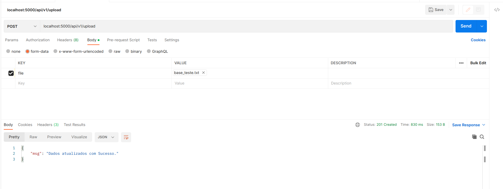

# data-handler-api

<p align="center">
  
  
  
</p>

API responsável por fazer a manipulação dos dados de um arquivo csv/txt e persistir numa base de dados relacional.

Código escrito na linguagem <a href="https://go.dev/" target="_blank">Golang</a> na versão 1.21.6, mais detalhes são descritos abaixo:

## Como Executar:

É possível executar a API, tal como seus testes, através do Docker ou no ambiente local, também foi criado um arquivo `Make` para facilitar algumas execuções. Além disso, para as execuções fora do Docker, atente-se para o arquivo `.env` que deve estar na pasta raiz do projeto. Caso deseje debugar os testes, também deve ter um arquivo `.env` na pasta `/tests/e2e`.

### Comandos Make:

- `make local-environment`: Inicia a API através do Docker, juntamente com os outros serviços necessários;
- `make e2e-tests`: Inicia um ambiente no Docker e roda todos os testes de integração;

### Docker:

Para rodar utilizando o Docker, basta utilizar o comando `make`:

```
make local-environment
```

Abrir um postman e fazer uma requisição POST localhost:5000/api/v1/upload passando um file, como na figura abaixo


Caso queira visualizar os dados inseridos, basta utilizar essas credenciais:
`user=data_api, password=data_api, host=localhost, port=5432, dbname=user_data`

### Testes:

Para rodar os testes basta utilizar o comando `make`:

```
make e2e-tests
```
